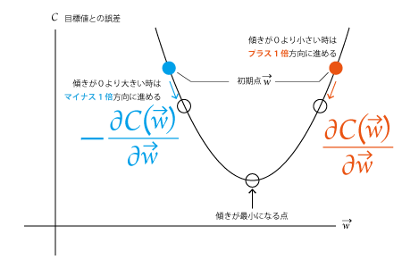
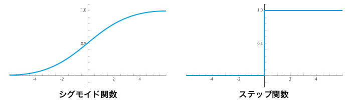

# 誤差逆伝播法の事前知識
## 誤差逆伝播法とは
`誤差逆伝播法（ごさぎゃくでんぱほう）英:Backpropagation（バックプロパゲーション）`  
- *ざっくり言うと*  
目標値と出力値の誤差を修正して目標値に近づける学習方法  
- *ざっくり理論*  
目標値と出力値を比較するために、  
(1)入力層から出力層へ向かって順方向に計算した出力値を出す  
(2)出力層から入力層に向かって逆方向に計算し目標値との誤差を把握する  
(3)誤差が小さくなるように値を調整する  
誤差が十分小さな値に近づくまで(1)(2)を繰り返す  

## 誤差逆伝播法を学習するメリット
誤差逆伝播法は、ニューラルネットワークで欠かすことの出来ない重要なアルゴリズムです。  
これを理解することでこの先の開発やデバッグ・設計において重要な役割を果たします。  
  
## ニューラルネットワークの前提知識
誤差逆伝播法を理解するにあたって、まずニューラルネットワークを構成する多層パーセプトロンの構造を理解する必要があります。簡単におさらいをしますが、詳しくはニューラルネットワークの章で確認してください。  
[【ニューラルネット】多層パーセプトロン（MLP）の原理・計算式](https://algorithm.joho.info/machine-learning/neural-network-mlp/)  
  
- *おさらい*  
多層パーセプトロンとは、下図のように入力層と中間層（隠れ層）と出力層が複数の層で構成された情報伝達構造を言います。
これは人間の脳の伝達方法を数理モデル化した簡略図ですが、ニューラルネットワークではこの多層パーセプトロンの構造を基に考えていくことができます。  

  
### 順伝播 (forward propagation)
`順伝播（じゅんでんぱ）英:forward propagation(フォワードプロパゲーション)`  

このような多層パーセプトロンの構造で、入力層から出力層まで一方向に漸化式にしたがって計算していく過程を「順伝播 (forward propagation)」といいます。

ここで入力と出力をイメージするために、一つの入力と一つの出力だけに注目した単体ニューロンを下図のように抜きだして説明します。  

  
入力x信号を受け取り、関数σで処理をして、出力y信号を受け渡します。  
  
この時、ニューラルネットワークの特徴として入力信号に**重み（w）**という値を掛け合わせます。さらに、**バイアス（b）**を加算するので、出力yは**y=σ(wx+b)**という式で表せます。  

  

## 誤差逆伝播法のゴール
誤差逆伝播法は、出力値から**重み（w）**と**バイアス（b）**の値を微分して最小になるように調整する作業で、出力値と目標値との誤差を最小化します。  

その為に、逆伝播の基礎とのなる４つの式を使って、ゴールを目指すことができます。  

1. *出力層での誤差δLに関する式：*  
  

1. *誤差δlの次層での誤差δl+1に関する表式：*  
  

1. *任意のバイアス（b）に関するコストの変化率の式：*  

  
1. *任意の重み（w）についてのコストの変化率の式：*  
  
  

## 誤差を求める方法
出力値と目標値の誤差を求める為の簡単な式は、一つの出力値に注目すれば「誤差(C1) ＝ 出力値(y1) - 目標値(t1)」で求められます。  

  

### コスト関数
`コスト関数（こすとかんすう）英:cost function（コストファンクション）`  

全体の出力の誤差を求めたいので、誤差の総和を取る為にΣを加えます。  
各出力値の2乗和誤差 (sum-of-squares error)を求めて、母平均からの距離をシンプルに評価しやすくします。

- 全体のデータの誤差を求める  

  
## 誤差を最小に調整する

### 最急降下法
`最急降下法（さいきゅうこうかほう）英: Gradient descent（グラディエントディサント）`  

最急降下法は、最適化問題（関数の最小化または最大化）の有名な手法の一つです。  
ニューラルネットワークの学習において、出力値と目標値の誤差を最小化したいので最急降下法が採用されています。  

最急降下法の手順は４つです。  
1. 初期点wベクトルを適当に決める  
  

1. 現在地より最急降下方向（関数の値が最も小さくなる方向）を計算する＝コスト関数を微分したマイナス一倍方向  
  

1. 最急降下方向に進める  
  
*η＝学習率*　と呼ばれています。  
最急降下方向にどれくらいのステップ幅で移動させるかの数値を与える必要があります。  
この数値が大きすぎると最小地点を通り過ぎてしまい、小さすぎるとたどり着くまで時間がかかります。

1. (2) と (3) を繰り返す  

### 確率的勾配降下法
`確率的勾配降下法（かくりつてきこうばいこうかほう、英: stochastic gradient descent（ストキャスティックグラディエントディセント）, SGD）`  

確率的勾配降下法とは、必要な勾配の計算を「確率」を使って高速に行う方法です。  
  
この時、訓練データnが膨大になると計算が大変になるというデメリットがあります。  
これを解消するために、ランダムに一つのデータの誤差を使ってパラメータを更新する作業を複数回繰り返す方法が確率的勾配降下法です。

*[確率的勾配降下法] = [最急降下法] ＋ [確率を使って高速に勾配計算する方法]*  

## 理解するために必要な数学の知識

### シグモイド関数について
`シグモイド関数（しぐもいどかんすう）英: sigmoid function（シグモイドファンクション）`  

出力する値を０か１のステップ関数で出力せずに、０から１の間のあらゆる数値を出力することで勾配の微小変化を計算できるようにする関数。  

  
- シグモイド関数の式  
  
> [シグモイド関数の大切な性質]: https://risalc.info/src/sigmoid-function.html#def
- シグモイド関数を微分する式（商の微分法を使って）  
  

### 偏微分について
`偏微分（へんびぶん）英: partial derivative（パーシャルデリバティブ）`  
- 偏微分の公式  
関数z＝f(x,y)のとき

### 連鎖率について
`連鎖律（れんさりつ） 英:chain rule（チェーンルール）`  

複数の関数が組み合わさった 合成関数 を微分する際のルールのこと  

- 連鎖率の公式（一変数関数）  
 
- 連鎖率の公式（多変数関数）  
 

