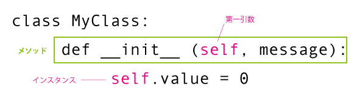
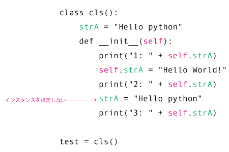
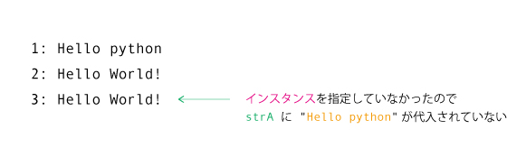

> selfはインスタンスオブジェクト自身を指しています。クラスの中でインスタンスオブジェクトを呼び出す際やそのインスタンスオブジェクトを呼び出す際は、selfを使用します。

## selfとは

selfはインスタンスオブジェクト自身を指しています。

Pythonではメソッドの第一引数に"self"を習慣的に定義しています。  
その後のインスタンスオブジェクトを指定する際に"self"を利用することができるようになります。  
したがって、selfはインスタンスオブジェクト自身と捉えることができるのです。  

  

メソッドを定義する際に、第一引数のselfを忘れると予期せぬエラーが起こる原因になるので、しっかり定義するようにしましょう。

## selfの注意点
また、Pythonでは”self.変数名”の表記でクラス変数やインスタンス変数を参照することができますが、
クラス変数にもインスタンス変数にも値がある場合は、インスタンス変数を優先して参照されることも留意してください。

  
  
  
実行結果  
  

selfを表記しないことでエラーや、思い通りの参照ができなくなる場合があるので注意して扱うようにしてください。

クラス内のメソッドが処理する対象はインスタンスオブジェクトになります。
selfはそのクラスにおけるメソッドの処理対象であるインスタンスオブジェクトを指定する際の第一引数として扱われています。
