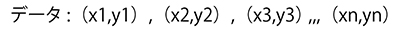
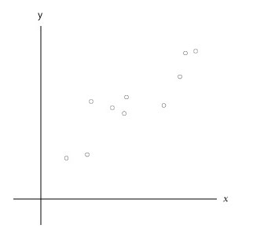
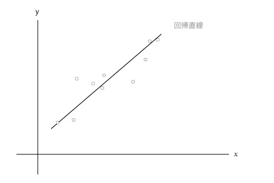
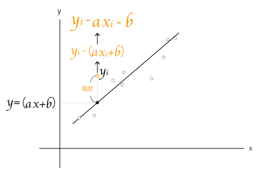
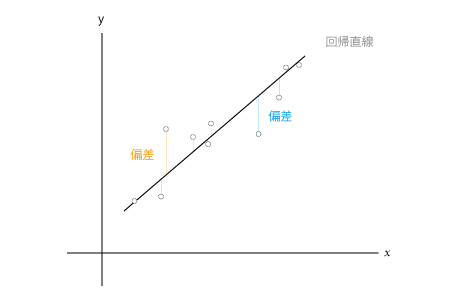
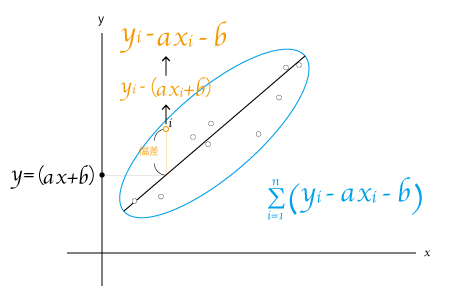
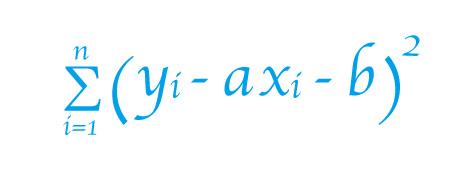
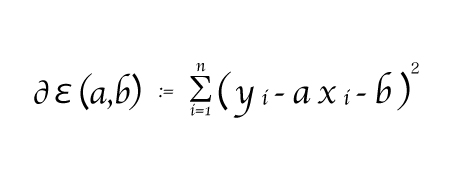
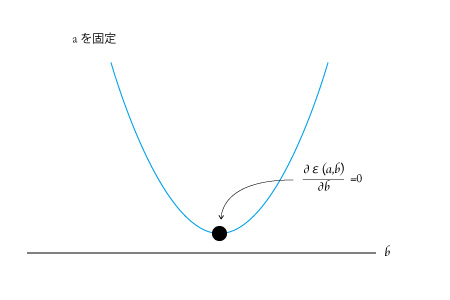
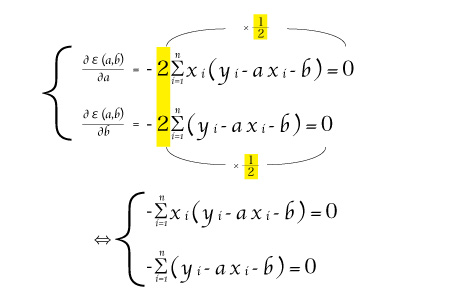

最小二乗法について、テキストを読んでも以下二点がよく分かりませんでしたので、ご回答をお願い致します。  
・なぜ2乗しているのか  
・なぜ最後に,2で割っているのか   

#  
> ・なぜ2乗しているのか  

最小二乗法は、偏差の２乗の和を最小にする関係式を求める方法です。  

偏差を２乗にする理由は、*偏差の値の符号の意味をなくす為です。*  

例えば、＋１０とー１０の偏差の値がある２つのデータがあるとします。   
お互い２０離れている関係なのに普通に計算すると＋ー打ち消し合って０になってしまいます。  
すると分布傾向の本質を見落としてしまいますね。  

このような不都合な計算をさせないために２乗します。  

それでは、ここからグラフと式で確認していきましょう。

例えば、このようなデータがあるとします。  
  

これをグラフにプロットすると下のような図になるとします。  
  

ここで現れるデータ集団に対して平均をとるように適当な線を引いてみます。  
  

この適当な線を数学的に引く（回帰直線を引く）為に、最小二乗法を使って求めていきます。  
こうした線が現れた場合、全体の分布傾向を分析してデータの本質を見極めたり、未来のデータを予測することができるようになります。  

*手順：*
1. 線の傾きと切片の値を求める。  
1. 全体の偏差の和をとる。　　

まず、直線の式は**y＝ax+b**なので（a=傾き）と（b=切片）を求めていきます。  

ここで一つのデータ（yi）に注目してみます。  

   

回帰直線は全体の平均あたりを通りたいので、線の上下（正と負）に差が現れるのが見えると思います。  
この差は「偏差」と呼ばれていて、線より上が正の偏差、線より下が負の偏差となるので、＋ー符号が付いた値になりますね。  
   

求めたい偏差の全体を求めたいので和をとることにします。  

   

ここで２乗をする理由が現れましたね！  
このままだと偏差の和を計算すると正と負の符号がでてきてしまうので偏差を２乗します。  

   

２乗をすることで＋の値は＋に、ーの値は＋に変わります。  
正と負の符号の意味をなくすために２乗した結果、偏差の距離を評価できるようになりました。  
全体のデータを大きくして偏差の距離が大きく離れても、直線の傾きは変わりません。  

このように、偏差の２乗を最小にしていくので、最小二乗法と言われています。  

*結論：正と負の符号の意味をなくして直線からの距離を評価するため*  

#  
> ・なぜ最後に,2で割っているのか

これは最小二乗法の最小を求める時に、微分して出てくる係数２を打ち消すために、最後に２で割って計算しやすくするためです。上記の証明をさらに進めていきます。  

この式から（a=傾き）と（b=切片）を求める為に関係式を続けていきます。  
この式に（a=傾き）と（b=切片）を求める関数名[イプシロン]ε(a,b)をつけます。  

  

この式で、aの傾きとbの切片の最小を求める計算で必ず微分します。  
そして２乗された係数は必ず正の値なので、下に凸の放物線になります。  

aを求める為にbを固定して微分します。  
bを固定した場合は、aの式をグラフに表すとき、必ず正の値なので、下に凸の放物線になります。 
  

bを求める為にaを固定して微分します。  
aを固定したグラフもbは必ず正の値なので、下に凸の放物線になります。  
  

その最小値を求めるにそれぞれ微分します。  

  

ここで係数２が出てきましたね！  

それぞれaとbを求めるために両辺を２で割る（1/2を掛ける）ことで計算しやすくなります。  

*結論：２乗の式を微分すると係数２が出てくるので、式を整理するために２で割ります。*  

